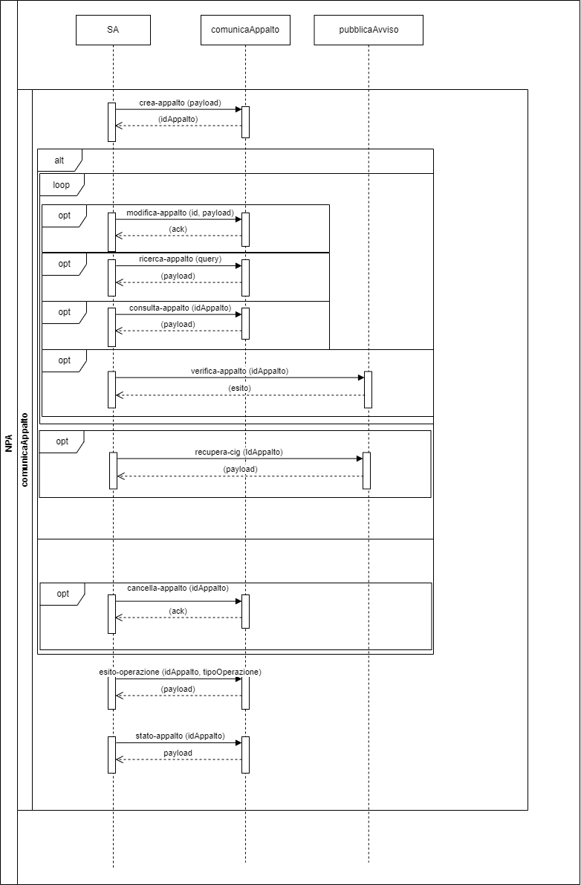
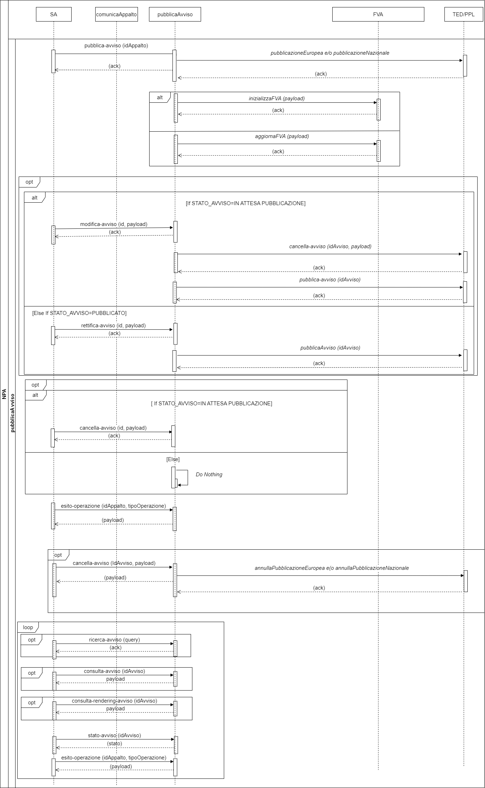
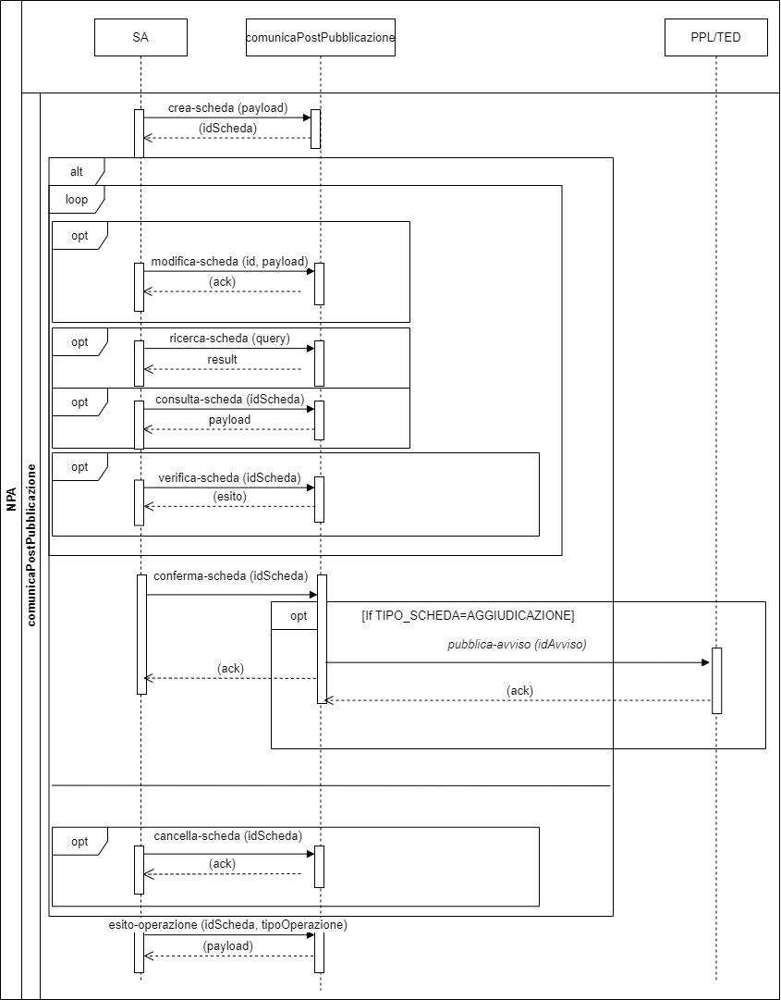
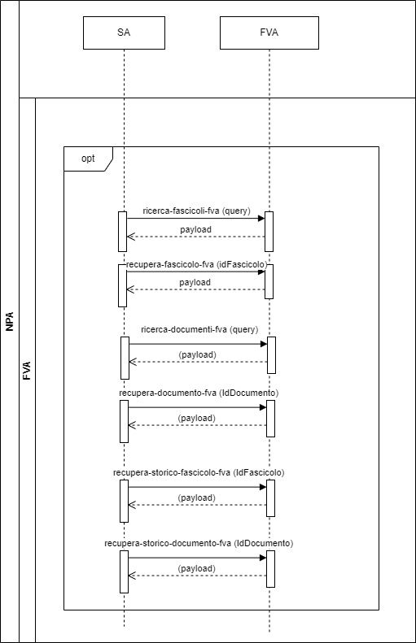
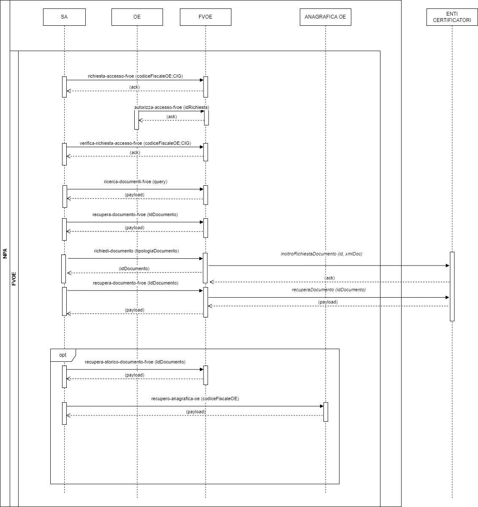

# 1 Definizioni, acronimi e riferimenti
# 2 Dati del documento
  ## 2.1 Definizioni e acronimi
  La presenza nel documento dell'abbreviazione **[tbd]** (to be defined) indica una parte per la quale non si hanno elementi sufficienti per procedere ad una completa definizione; come tale sarà subordinata ad un'ulteriore definizione in una successiva versione del documento.
  
La presenza nel documento dell'abbreviazione **[tbc]** (to be confirmed) indica una parte per la quale sono stati assunti elementi che debbono essere confermati; come tale sarà subordinata ad una conferma in fase successiva.

La presenza nel documento dell'abbreviazione **[na]** (non applicabile) indica che un argomento previsto nello standard di struttura di questo documento, risulta privo di significato nel contesto di questo sistema.

  
  |  |  | 
  | ------------- | ------------- | 
  | AVCP  | Autorità per la Vigilanza Contratti Pubblici(dal 2014 accorpata nell’ANAC). |
  | ANAC  | Autorità Nazionale Anticorruzione |  
  | Autorità  | Si riferisce all’ANAC |
  | UAFI  | Ufficio Analisi Flussi Informativi |
  | UPSI  | Ufficio Progettazione e sviluppo, Servizi Informatici e Gestione del Portale dell’ANAC. |  
  | UESI  | Ufficio Esercizio Sistemi |
  | BDNCP  | Banca Dati Nazionale dei Contratti Pubblici Anagrafe unica dei contratti pubblici. È la banca dati di riferimento di ANAC per utenze e soggetti rappresentati. |
  | Portale Internet  | Punto di erogazione dei servizi web per gli utenti esterni ANAC |
  | Servizi ANAC  | Nucleo centralizzato di servizi che contengono la logica di Business dell’Autorità. |
  
  ## 2.1 Convenzioni di carattere generale
  ## 2.3	Convenzioni di progettazione
  ## 2.4	Contesto normativo
  ## 2.5	Riferimenti interni
  ## 2.6	Riferimenti esterni
# 3	Obiettivo del documento 
Il presente documento ha lo scopo di definire le specifiche di interfaccia con i sistemi che interoperano con il nuovo sistema di digitalizzazione appalti che si articola in: Nuova Piattaforma Appalti (NPA), Nuova Piattaforma Appalti estesa (NPA estesa) e Fascicolo Virtuale dell’Operatore Economico (FVOE).

Tale sistema ha inoltre l’obiettivo di descrivere l’ampio scenario nel quale le Piattaforme si collocano, considerando il quadro normativo di riferimento e indicando i processi esterni collegati e che concorrono a definire la Banca Dati Nazionale dei Contratti Pubblici (BDNCP).

In particolare, viene preso in considerazione l’attuale contesto normativo, a partire dal D.lgs. 18 aprile 2016 n. 50 – il Codice dei contratti – aggiornato in base agli ultimi provvedimenti amministrativi e ai recenti provvedimenti emanati nell’ambito del PNRR, Piano Nazionale per la Ripresa e la Resilienza presentato dall’Italia a norma del Regolamento (UE) 2021/241, approvato con Decisione del Consiglio ECOFIN del 13 luglio 2021 e notificato all’Italia dal Segretariato generale del Consiglio con nota LT161/21, del 14 luglio 2021.

L’art. 44 del D.lgs. 18 aprile 2016 n. 50, prevede che «siano definite le modalità di digitalizzazione delle procedure di tutti i contratti pubblici, anche attraverso l'interconnessione per interoperabilità dei dati delle pubbliche amministrazioni. Sono, altresì, definite le migliori pratiche riguardanti metodologie organizzative e di lavoro, metodologie di programmazione e pianificazione, riferite all'individuazione dei dati rilevanti, alla loro raccolta, gestione ed elaborazione, soluzioni informatiche, tecnologiche e infrastrutturali di supporto».

Lo studio si prefigge di definire le soluzioni tecnologiche capaci di integrare i ruoli di tutti gli stakeholder affinché le procedure di appalto pubblico possano essere interamente gestite con sistemi telematici di acquisto e di negoziazione, nel rispetto delle disposizioni dettate dal medesimo Codice.
# 4	Architettura generale 
La nuova piattaforma integrata mira a digitalizzare i processi dell’intero ciclo di vita dell’appalto, attraverso la realizzazione di una serie di strumenti che abilitano l’integrazione e l’interoperabilità tra le piattaforme telematiche presenti nell’eco-sistema nazionale dell’e-procurement.

Di seguito si riporta una rappresentazione dell’ecosistema di approvvigionamento digitale per la gestione degli appalti pubblici:

# 5 Descrizione del contesto
L’architettura applicativa complessiva prevede le seguenti componenti:

- Nuova Piattaforma Appalti estesa (NPA)
- Fascicolo Virtuale Operatore Economico (FVOE)
- Nuova Piattaforma Appalti Estesa (NPA Estesa)

La Nuova Piattaforma Appalti (NPA) ha lo scopo principale di monitorare il ciclo di vita dell’appalto, attraverso la gestione e la raccolta delle informazioni rilevanti nei processi che compongono l’intero ciclo di vita.

Nella raccolta delle informazioni di monitoraggio, la NPA svolge un ruolo prevalentemente passivo, mentre assume un ruolo attivo nella gestione delle fasi di Avvio della Procedura e di Pubblicazione, dove gli strumenti (servizi e funzionalità WEB) resi disponibili, consentono sia l’integrazione con eventuali piattaforme telematiche dell’Amministrazione (SA), che la completa digitalizzazione dei flussi attraverso uno scambio informativo (ESPD Request). 

La Nuova Piattaforma Appalti, quindi dispiega i servizi per l’integrazione (b2b – Business to Business) con altri sistemi esterni al dominio ANAC al fine di abilitare una completa digitalizzazione e automazione tra i diversi attori operanti nell’ecosistema appalti, che interfacce web   a supporto delle Amministrazioni che non posseggono la capacità per questo tipo di integrazione. 

La nuova architettura prevede la dematerializzazione dei flussi, dove normativamente consentito, attraverso l’adozione degli standard e delle regole tecniche di interoperabilità tra le piattaforme di e-procurement, come ad esempio ESPD Request (European Single Procurement Document) per la parte di definizione ed avvio della procedura e ESPD Response per la componente di negoziazione.

## 5.1	Diagramma di contesto
Nel seguente diagramma di contesto sono rappresentati i servizi dell’NPA esposti e fruibili dai sistemi esterni:

Nella seguente [cartella](../diagrammi-drawio/), è consultabile il diagramma drawio.

## 5.2	Flusso di Interoperabilità
Nel presente paragrafo si rappresentano i flussi di interoperabilità di tutto il ciclo di appalto attraverso l’uso del Sequence Diagram:

**Legenda:**
- *Nome servizio* = Servizi che richiamano la PPL o TED (esterne rispetto all’NPA) per la pubblicazione nazionale e/o europea.
- Nome servizio = Servizi che richiamano contesti e componenti interne all’NPA.

Nella seguente [cartella](../diagrammi-drawio/), è consultabile il diagramma drawio.

## 5.3	Diagramma a stati
Nei paragrafi che seguono sono illustrati, attraverso diagrammi a stati, i passaggi di stato per le seguenti entità coinvolte:

1. **Appalto**
2. **Avviso**
3. **TED**

Il diagramma riporta, per ogni entità, lo stato di partenza e le frecce orientate ad indicare il servizio invocato per completare la transizione di stato.

### 5.3.1 Diagramma a stati Appalto
Il diagramma seguente illustra i cambi di stato dell’entità Appalto:

Nella seguente [cartella](../diagrammi-drawio/), è consultabile il diagramma drawio.

### 5.3.2 Diagramma a stati Avviso
Il diagramma seguente illustra i cambi di stato dell’entità Avviso:

Nella seguente [cartella](../diagrammi-drawio/), è consultabile il diagramma drawio.

### 5.3.3 Diagramma a stati TED
Il diagramma seguente illustra i cambi di stato dell’entità Notice di TED:

Nella seguente [cartella](../diagrammi-drawio/), è consultabile il diagramma drawio.

# 6	Contesto pianificazioneAppalto
Nel seguente contesto sono inclusi i servizi utilizzabili dalla SA utili alla gestione della prima fase di pianificazione e programmazione mediante la creazione e la conferma dell’Avviso di Preinformazione.

L’avviso di Preinformazione (disciplinato all’art. 70 del Nuovo codice degli Appalti) è uno strumento per l’indizione della procedura di scelta del contraente, adottato da una stazione appaltante che intenda aggiudicare un contratto pubblico.

L’avviso di preinformazione deve contenere:

- specifico riferimento alle forniture, ai lavori o ai servizi oggetto dell’appalto;
- indicazione che l’appalto sarà aggiudicato mediante una procedura ristretta o una procedura competitiva con negoziazione senza ulteriore pubblicazione di un avviso di indizione di gara;
- un invito agli operatori economici interessati a manifestare il proprio interesse;
- ulteriori informazioni (Nuovo Codice dei Contratti Pubblici – Allegato XIV), tra cui: contatti dell’amministrazione aggiudicatrice e modalità di accesso ai documenti di gara; codici relativi all’appalto (CPV; NUTS); breve descrizione dell’appalto (natura ed entità dei lavori, natura e quantità/valore delle forniture; natura ed entità dei servizi); indicazione del fatto che gli operatori economici interessati devono far conoscere all’amministrazione aggiudicatrice il loro interesse per l’appalto; tipologia di procedura di aggiudicazione; termini e indirizzo per la ricezione delle manifestazioni d’interesse.

Il periodo coperto dall’avviso di preinformazione può durare al massimo dodici mesi dalla data di trasmissione dell’avviso per la pubblicazione, salvo nel caso di appalti pubblici per servizi sociali e altri servizi affini (Nuovo Codice degli Appalti Pubblici, art. 142; Allegato IX), per i quali l’avviso di preinformazione può coprire un periodo non superiore a ventiquattro mesi.

**Descrizione dei servizi**

I servizi che devono essere obbligatoriamente richiamati per questo contesto del ciclo di vita dell’Appalto sono i seguenti:

- **creaPiano**: servizio utile per l’inserimento in bozza di un avviso di preinformazione. 
A seguito dell’invocazione di questo servizio, il Piano transita nello stato “IN LAVORAZIONE”;
- **confermaPiano**: servizio che ha lo scopo di validare e confermare i dati del Piano. A seguito dell’invocazione di questo servizio, lo stato del Piano transita in “CONFERMATO”.

Servizi <ins>facoltativi</ins>, una volta richiamato il creaPiano, possono essere invocati i seguenti servizi:
- modificaPiano: servizio che va a sostituire il Piano creato precedentemente con una nuova bozza. Solo l’ultima istanza ricevuta del piano sarà oggetto delle successive fasi del processo;
- verificaPiano: servizio di validazione dell’avviso di preinformazione in bozza. Tale validazione viene eseguita solo per l’ultima istanza del piano inviato e va a verificare il rispetto dell’obbligatorietà degli input rispetto alle regole di pubblicazione;
- ricercaPiano: servizio che permette la ricerca del Piano sulla base dei criteri di input;
- consultaPiano: servizio che consente la consultazione delle informazioni di dettaglio di un Piano;
- cancellaPiano: servizio di cancellazione logica della bozza del Piano creata o modificata. A seguito dell’invocazione di tale servizio, il Piano transita in stato “CANCELLATO” (Stato finale).

## 6.1	Flusso di Interoperabilità
Di seguito si riporta la rappresentazione tramite Sequence Diagram dei servizi che l’SA potrà richiamare in questa fase:

Nella seguente [cartella](../diagrammi-drawio/), è consultabile il diagramma drawio.

# 7	Contesto comunicaAppalto
In questa fase del processo avviene la creazione dell’appalto, la formalizzazione dei fabbisogni della SA e, al termine di tutte le verifiche necessarie, l’emissione del CIG.
I servizi di seguito descritti potranno essere pertanto richiamati dalle SA fino all’emissione dei CIG ai diversi lotti che compongono l’Appalto: l’Appalto, fino a quel momento, sarà in uno stato di “bozza”.

**Descrizione servizi**
I servizi che devono essere obbligatoriamente richiamati per questo contesto del ciclo di vita dell’Appalto sono i seguenti:
-	**crea-appalto**: servizio che consente l’inserimento della prima istanza (in bozza) di un Appalto. A seguito dell’invocazione di questo servizio, l’Appalto transita in stato “IN LAVORAZIONE”;
-	**conferma-appalto**: tale servizio serve a confermare i dati dell’Appalto e ad assegnare i CIG.

Servizi facoltativi, una volta richiamato il crea-appalto, possono essere i seguenti:

- modifica-appalto: servizio che va a sostituire integralmente la precedente istanza dell’Appalto con una nuova bozza, pertanto solo l’ultima istanza ricevuta dell’Appalto sarà oggetto delle successive fasi del processo. L’Appalto rimane in stato “IN LAVORAZIONE”;
- verifica-appalto: servizio che consente la validazione dell’ultima istanza di Appalto ricevuta. Il servizio verifica il rispetto dell’obbligatorietà degli input rispetto alle regole di pubblicazione:
  - eForms di gara: input obbligatorio in caso di pubblicazione europea. 
  - espdRequest: input obbligatorio in caso di pubblicazione europea e nazionale o solo nazionale (la pubblicazione nazionale è sempre mandatoria in presenza di quella europea)
  - anacForm: input obbligatorio in caso di pubblicazione europea e nazionale o solo nazionale (la pubblicazione nazionale è sempre mandatoria in presenza di quella europea)
- cancella-appalto: servizio che consente, qualora lo stato dell’Appalto sia “IN LAVORAZIONE”, la cancellazione logica di un Appalto in bozza. a seguito dell’invocazione di questo servizio l’Appalto transita in stato “CANCELLATO”;
- ricerca-appalto: servizio che permette la ricerca dell’Appalto sulla base dei criteri di input. Lo stato dell’Appalto, per poter invocare il servizio, dovrà essere “IN LAVORAZIONE”, ”CANCELLATO”, “CONFERMATO”;
- consulta-appalto: servizio che consente la consultazione delle informazioni di dettaglio di un Appalto;
- recupera-cig: servizio che consente il recupero dei CIG generati e assegnati ai lotti dell’Appalto. Lo stato dell’Appalto per poter richiamare tale servizio dovrà essere “CONFERMATO”.

## 7.1	Flusso di Interoperabilità
Di seguito si riporta la rappresentazione tramite Sequence Diagram dei servizi che l’SA potrà richiamare in questa fase:

# 8	Contesto pubblicaAvviso
In questa fase del processo avviene la pubblicazione, a livello europeo e/o nazionale, degli avvisi relativi all’Appalto o ad una delle schede successive che prevedono la pubblicazione (ad esempio: aggiudicazione, modifica contrattuale, ecc).

**Descrizione servizi**

I servizi che devono essere obbligatoriamente richiamati per questo contesto del ciclo di vita dell’Appalto sono i seguenti:
-	**pubblica-avviso**: attraverso l’invocazione di tale servizio viene richiesta la pubblicazione di un Avviso, a livello nazionale e/o europeo, relativo all’ultima istanza dell’Appalto validato e confermato mediante il servizio confermaAppalto. A seguito della chiamata a questo servizio, l’avviso transita in stato “IN ATTESA PUBBLICAZIONE”.

Sarà possibile invocare anche i seguenti servizi facoltativi:

-	cancella-avviso: servizio di sospensione di una richiesta di pubblicazione, sia nazionale sia europea, di un avviso non ancora pubblicato. L’Appalto transita nello stato “STOP PUBBLICAZIONE” e l’Avviso in “ANNULLA PUBBLICAZIONE”;
-	modifica-avviso: servizio di creazione di un nuovo Avviso che sostituisce il precedente non ancora pubblicato. L’Appalto rimane in stato “IN ATTESA PUBBLICAZIONE” e l’avviso transita nello stato “IN ATTESA PUBBLICAZIONE”;
-	rettifica-avviso: servizio utile alla creazione di un’avviso di rettifica in caso di pubblicazione già avvenuta; L’Appalto rimane nello stato “PUBBLICATO”, mentre lo stato dell’avviso transiterà in ”IN ATTESA PUBBLICAZIONE”.
-	stato-avviso: servizio tramite il quale avviene il recupero dello stato in cui si trova un Avviso;
-	recupera-cig: servizio per il recupero dei CIG generati e assegnati ai lotti dell’Appalto. Il servizio è il medesimo descritto nel contesto di comunicaAppalto;
-	ricerca-avviso: servizio per la ricerca degli avvisi di un appalto in base ai criteri di input. 
-	consulta-avviso: servizio per la consultazione delle informazioni di dettaglio di un Avviso 
-	get-rendering-avviso: servizio per consentire la consultazione in formato pdf dell’Avviso.

## 8.1	Flusso di Interoperabilità
Di seguito si riporta il diagramma di sequenza che illustra le interfacce dei vari servizi e le interazioni con i sistemi esterni:

# 9	Contesto comunicaPostPubblicazione
In questo contesto rientrano tutti i servizi richiamabili dalla SA finalizzati alla gestione delle fasi del ciclo di vita dell’Appalto successive alla pubblicazione di un bando di gara. I servizi permetteranno la creazione, l’invio e il recupero delle schede contenenti i dati necessari al monitoraggio delle fasi di aggiudicazione ed esecuzione di un appalto.  

A titolo esemplificativo si riportano di seguito alcune ipotetiche schede dati:
-	Elenco Partecipanti
-	Aggiudicazione
-	Avvio Contratto
-	Avanzamento Contratto
-	Conclusione Contratto
-	Collaudo Contratto
-	Sospensione
-	Ripresa Esecuzione Contratto
-	Risoluzione Contratto
-	Modifica Contratto
-	Subappalto
-	Recesso
-	Contenzioso
-	Accordo Quadro

**Descrizione servizi**

I servizi che devono essere obbligatoriamente richiamati per questo contesto del ciclo di vita dell’Appalto sono i seguenti:
-	**crea-scheda**: servizio che consente l’inserimento di una scheda dati che può essere relativa sia alla fase di aggiudicazione sia a quella di esecuzione. La scheda, a seguito dell’invocazione del servizio, transita nello stato “IN LAVORAZIONE”;
-	**conferma-scheda**: il servizioserve a confermare i dati della Scheda e per poter essere invocato è necessario che questa sia in stato “IN LAVORAZIONE” dopo la creazione o modifica di una scheda in bozza. Il sistema, attraverso l’invocazione del servizio verifica-scheda, provvede alla validazione dei dati della scheda. Tale validazione è orchestrata da un Workflow Engine che, tramite il suo motore di regole effettua le seguenti operazioni:
  -	verifica se la scheda dati è coerente con lo stato dell’Appalto; 
  -	effettua una validazione sintattica dei dati di input. 

Nel caso in cui si tratti di una scheda che prevede la pubblicazione sulla Piattaforma nazionale o sul TED il sistema invocherà il servizio pubblica-avviso per completare la transizione allo stato successivo dell’Appalto o per poter confermare la scheda successiva in lavorazione. 

Sarà possibile invocare anche i seguenti servizi facoltativi:
-	modifica-scheda: servizio generico che sostituisce integralmente la precedente scheda inviata con una nuova bozza. La scheda rimane nello stato “IN LAVORAZIONE” e  il servizio sarà invocabile ciclicamente finché non sarà invocato il servizio confermaScheda;
-	verifica-scheda: servizio che consente la validazione di una scheda dati; tale validazione è orchestrata da un Workflow Engine che, tramite il suo motore di regole effettua le seguenti operazioni:
  -	verifica se la scheda dati è coerente con lo stato dell’Appalto; 
  -	effettua una validazione sintattica dei dati di input. 
-	cancella-scheda: servizio di cancellazione logica di una scheda in stato bozza. Per poter invocare il servizio, la scheda deve essere in stato “IN LAVORAZIONE” e a seguito della chiamata transiterà in stato “CANCELLATA”.
-	ricerca-scheda: servizio che permette la ricerca della scheda sulla base dei criteri di input;
-	consulta-scheda: servizio che consente la consultazione delle informazioni di dettaglio di una scheda dati.

## 9.1	Flusso di Interoperabilità
Di seguito si riporta il diagramma di sequenza che illustra le interfacce dei vari servizi e le interazioni con i sistemi esterni:

# 10	Contesto FVA
All’interno della NPA è costituito e mantenuto il Fascicolo Virtuale dell’Appalto (FVA) che ha l’obiettivo di gestire le informazioni digitali relative agli atti e/o avvisi di pertinenza dell’Appalto. 
Nell’FVA confluisce quindi tutto il corpus informativo della gara d’appalto, che si viene a costituire dalle prime fasi del ciclo di gara.

**Descrizione dei servizi**

I servizi facoltativi che l’SA potrà invocare relativamente al Fascicolo dell’Appalto sono i seguenti:
-	ricerca-fascicoliFVA: servizio che permette la ricerca di fascicoli dell’Appalto in base ai criteri di input;
-	recupera-fascicoloFVA: servizio che permette la consultazione delle informazioni di dettaglio di un fascicolo;
-	ricerca-documentiFVA: servizio che permette la ricerca dei documenti di un Fascicolo sulla base dei criteri di input;
-	recupera-documentoFVA: servizio che permette la consultazione delle informazioni di dettaglio di un documento;
-	recupera-storico-fascicolo-fva: servizio che consente di recuperare la history e tutte le operazioni effettuate sul fascicolo;
-	recupera-storico-documento-fva: servizio che consente di recuperare la history e tutte le operazioni effettuate sul documento.

## 10.1	Flusso di Interoperabilità
Di seguito si riporta il diagramma di sequenza che illustra le interfacce dei vari servizi e le interazioni con i sistemi esterni:

# 11	Contesto FVOE
Il Fascicolo Virtuale dell’Operatore Economico è un componente del sistema che offre servizi sia alla SA che all’Operatore economico e ha l’obiettivo di raccogliere tutte informazioni e la documentazione afferente a un Operatore Economico che partecipa ad una gara.
L’FVOE prevede sia l’esposizione di servizi API per l’integrazione con le piattaforme esterne, sia funzionalità con interfaccia Web per consentire l’accesso e le operazioni sul Fascicolo agli Operatori Economici.

**Descrizione dei servizi**

I servizi facoltativi che l’SA potrà invocare relativamente al Fascicolo dell’Operatore economico sono i seguenti:
-	richiedi-accesso-fvoe: servizio che permettedi richiedere l’accesso alle informazioni di dettaglio del fascicolo di un OE immettendo in input il codice fiscale dell’OE e il CIG;
-	verifica-stato-richiesta-accesso: servizio che permette di conoscere lo stato della richiesta di accesso al fascicolo inoltrata attraverso l’invocazione del servizio richiediAccessoFVOE;
-	ricerca-documenti: servizio che permette la ricerca dei documenti di un Fascicolo sulla base dei criteri di input;
-	recupera-documento: servizio che permette la consultazione delle informazioni di dettaglio di un documento;
-	richiedi-documento: servizio che consente di richiedere agli enti certificatori un documento specifico;
-	recupera-documento: servizio che consente di recuperare il documento richiesto;
-	recuperaStoricoDocumento: attraverso l’invocazione di tale servizio sarà possibile recuperare la history e tutte le operazioni effettuate su quel documento;
-	recupera-anagrafica-oe: tramite questo servizio sarà possibile recuperare l’anagrafica degli operatori economici immettendo come input il codice fiscale dell’OE.

## 11.1	Flusso di Interoperabilità
Di seguito si riporta il diagramma di sequenza che illustra le interfacce dei vari servizi e le interazioni con i sistemi esterni:

# 12	Servizi comuni

In questo capitolo si riportano i servizi comuni, ossia quelli che possono essere richiamati dalle Stazioni appaltanti in più contesti dell’NPA e che forniranno una risposta diversa a seconda della fase in cui vengono invocati:
-	esito-operazione: tramite questo servizio è possibile recuperare l’esito di una determinata operazione;
   - [SE il contesto è comunicaAppalto] recupero l’esito per le seguenti operazioni : “crea-appalto”, “modifica-appalto”, “cancella-appalto”, “conferma-appalto”, “verifica-appalto”.
   - [SE il contesto è pubblicaAvviso] 
 [SE lo stato Avviso è “In attesa pubblicazione” su TED] chiama l’ API TED “search-esentool” per  l’esito di pubblicazione sul sistema europeo.
 [SE lo stato Avviso è “In attesa pubblicazione” su PPL-ANAC] chiama il servizio di back-end “ricerca-avviso-nazionale” per la verifica dell’esito di pubblicazione su PPL-ANAC.
Ritorna l’esito per le seguenti operazioni: “pubblica-pvviso”, “modifica-avviso”, “cancella-avviso”, “rettifica-avviso”
  - [SE il contesto è comunicaPostPubblicazione] recupero l’esito per le seguenti operazioni: “crea-scheda ”, “modifica-scheda”, “cancella-scheda”, “conferma-scheda”, “verifica-scheda”
-	stato-appalto: tramite questo servizio è possibile conoscere lo stato dell’Appalto in un determinato momento.

# 13	Contesto di sicurezza
Le Linee Guida di interoperabilità PDND sono destinate ai soggetti di cui all’articolo 2, comma 2, del CAD, i quali favoriscono la conoscenza e l’utilizzo del patrimonio informativo detenuto per finalità istituzionali nonché la condivisione dei dati con i soggetti che hanno diritto di accedervi ai fini dell’attuazione dell’articolo 50 del CAD e della semplificazione degli adempimenti dei cittadini e delle imprese, in conformità alla disciplina vigente, assicurando le modalità di scambio telematico per il tramite di API così come previsto dal MoDI. 

In particolare, i soggetti di cui all’articolo 2, comma 2, del CAD attuano le Linee Guida al fine di condividere i dati e le informazioni da essi detenuti, assicurando:
- l’implementazione di interfacce di programmazione delle applicazioni accessibili tramite Internet (di seguito API) conformi alle [LG INTEROPERABILITÀ TECNICA];
- la registrazione delle API, di cui al precedente punto, nel Catalogo API reso disponibile dell’Infrastruttura interoperabilità PDND.

In tale contesto, i soggetti di cui all’art. 2, comma 2, del CAD agiscono in veste di soggetti erogatori.
Le Linee Guida sono rivolte, altresì, ai soggetti privati che, unitamente ai citati soggetti di cui all’art. 2, comma 2, del CAD, sono abilitati a fruire della PDND al fine di accedere ai dati e alle informazioni ivi resi disponibili, previa sottoscrizione degli Accordi di Interoperabilità nel Catalogo API, resi disponibili dall’Infrastruttura interoperabilità PDND.

In tale contesto, i soggetti di cui all’art. 2, comma 2 del CAD e i soggetti privati agiscono in qualità di soggetti fruitori della PDND.
I soggetti fruitori che non fanno parte della PDND dovranno rispettare gli standard di interoperabilità MoDI.

# 14	Interfaccia servizi
Le interfacce dei servizi sono definite secondo gli standard di interoperabilità tramite API dei sistemi informatici che tutte le pubbliche amministrazioni devono adottare al fine di garantire l’interoperabilità dei propri sistemi con quelli di altri soggetti a favorire l’implementazione complessiva del sistema informativo delle PA (ModI).
