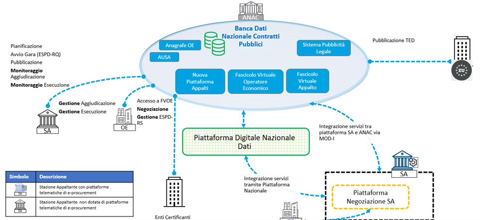
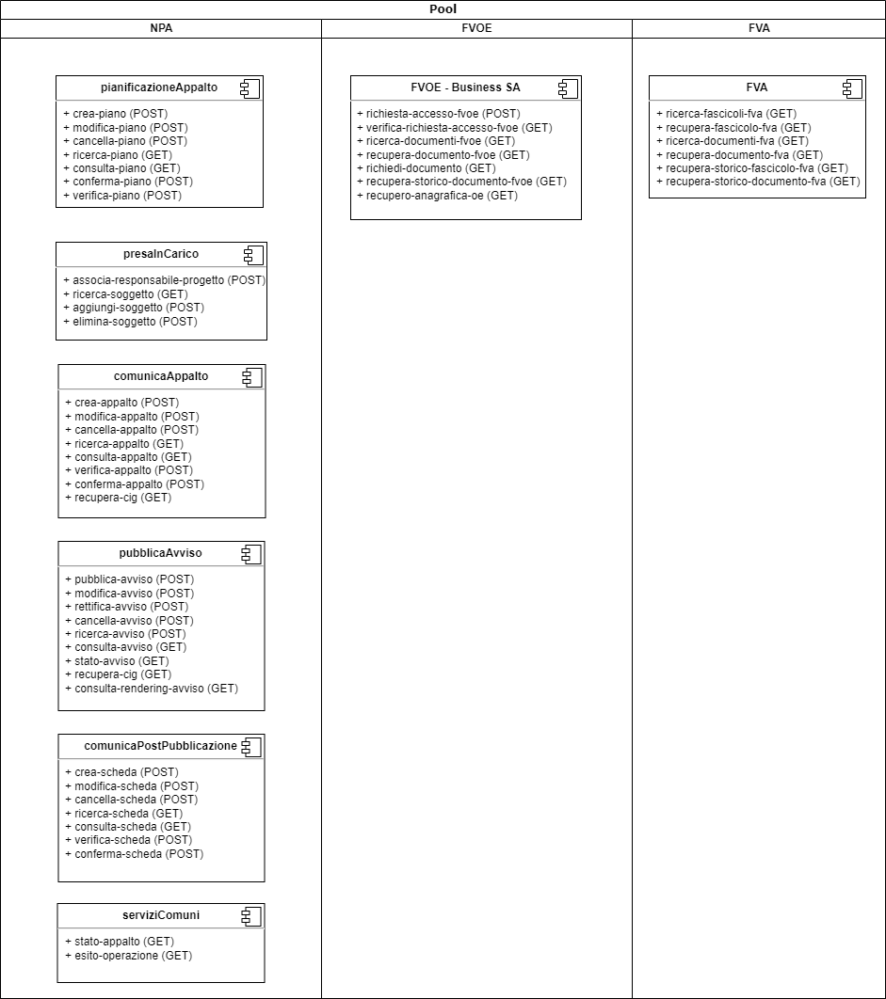
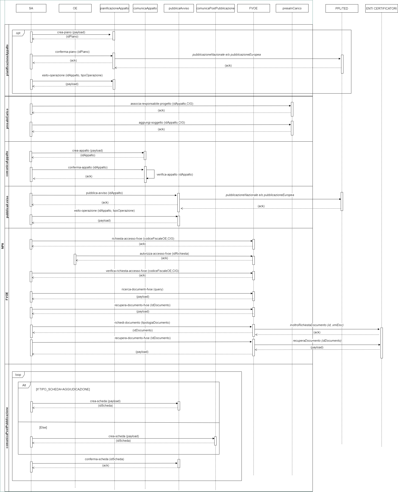
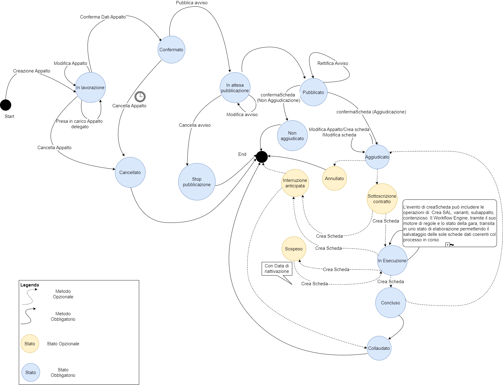
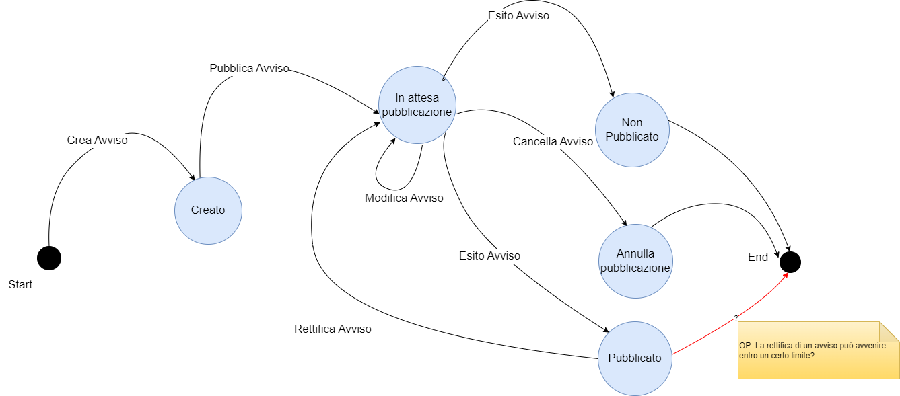
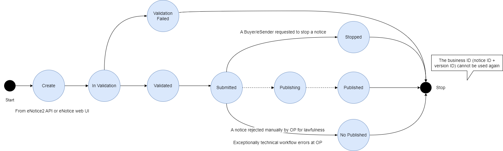
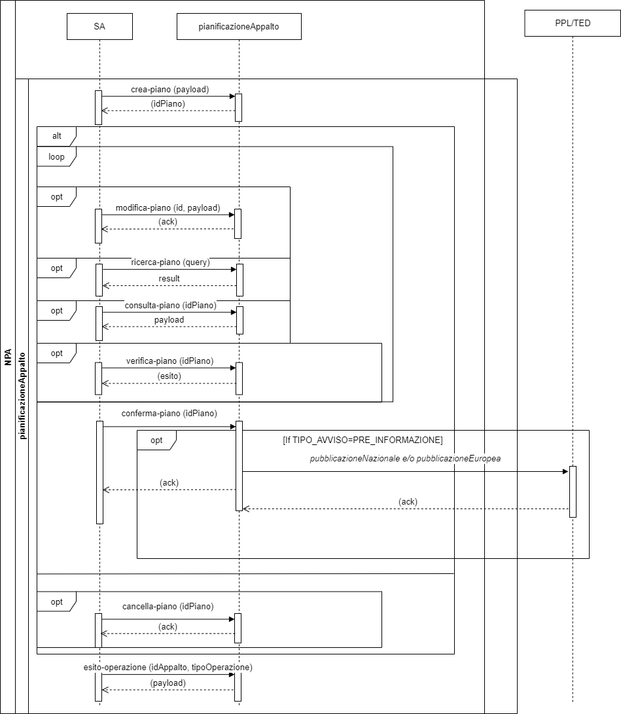

# 1 Definizioni, acronimi e riferimenti
# 2 Dati del documento
  ## 2.1 Definizioni e acronimi
  La presenza nel documento dell'abbreviazione **[tbd]** (to be defined) indica una parte per la quale non si hanno elementi sufficienti per procedere ad una completa definizione; come tale sarà subordinata ad un'ulteriore definizione in una successiva versione del documento.
  
La presenza nel documento dell'abbreviazione **[tbc]** (to be confirmed) indica una parte per la quale sono stati assunti elementi che debbono essere confermati; come tale sarà subordinata ad una conferma in fase successiva.

La presenza nel documento dell'abbreviazione **[na]** (non applicabile) indica che un argomento previsto nello standard di struttura di questo documento, risulta privo di significato nel contesto di questo sistema.

  
  |  |  | 
  | ------------- | ------------- | 
  | AVCP  | Autorità per la Vigilanza Contratti Pubblici(dal 2014 accorpata nell’ANAC). |
  | ANAC  | Autorità Nazionale Anticorruzione |  
  | Autorità  | Si riferisce all’ANAC |
  | UAFI  | Ufficio Analisi Flussi Informativi |
  | UPSI  | Ufficio Progettazione e sviluppo, Servizi Informatici e Gestione del Portale dell’ANAC. |  
  | UESI  | Ufficio Esercizio Sistemi |
  | BDNCP  | Banca Dati Nazionale dei Contratti Pubblici Anagrafe unica dei contratti pubblici. È la banca dati di riferimento di ANAC per utenze e soggetti rappresentati. |
  | Portale Internet  | Punto di erogazione dei servizi web per gli utenti esterni ANAC |
  | Servizi ANAC  | Nucleo centralizzato di servizi che contengono la logica di Business dell’Autorità. |
  
  ## 2.1 Convenzioni di carattere generale
  ## 2.3	Convenzioni di progettazione
  ## 2.4	Contesto normativo
  ## 2.5	Riferimenti interni
  ## 2.6	Riferimenti esterni
# 3	Obiettivo del documento 
Il presente documento ha lo scopo di definire le specifiche di interfaccia con i sistemi che interoperano con il nuovo sistema di digitalizzazione appalti che si articola in: Nuova Piattaforma Appalti (NPA), Nuova Piattaforma Appalti estesa (NPA estesa) e Fascicolo Virtuale dell’Operatore Economico (FVOE).

Tale sistema ha inoltre l’obiettivo di descrivere l’ampio scenario nel quale le Piattaforme si collocano, considerando il quadro normativo di riferimento e indicando i processi esterni collegati e che concorrono a definire la Banca Dati Nazionale dei Contratti Pubblici (BDNCP).

In particolare, viene preso in considerazione l’attuale contesto normativo, a partire dal D.lgs. 18 aprile 2016 n. 50 – il Codice dei contratti – aggiornato in base agli ultimi provvedimenti amministrativi e ai recenti provvedimenti emanati nell’ambito del PNRR, Piano Nazionale per la Ripresa e la Resilienza presentato dall’Italia a norma del Regolamento (UE) 2021/241, approvato con Decisione del Consiglio ECOFIN del 13 luglio 2021 e notificato all’Italia dal Segretariato generale del Consiglio con nota LT161/21, del 14 luglio 2021.

L’art. 44 del D.lgs. 18 aprile 2016 n. 50, prevede che «siano definite le modalità di digitalizzazione delle procedure di tutti i contratti pubblici, anche attraverso l'interconnessione per interoperabilità dei dati delle pubbliche amministrazioni. Sono, altresì, definite le migliori pratiche riguardanti metodologie organizzative e di lavoro, metodologie di programmazione e pianificazione, riferite all'individuazione dei dati rilevanti, alla loro raccolta, gestione ed elaborazione, soluzioni informatiche, tecnologiche e infrastrutturali di supporto».

Lo studio si prefigge di definire le soluzioni tecnologiche capaci di integrare i ruoli di tutti gli stakeholder affinché le procedure di appalto pubblico possano essere interamente gestite con sistemi telematici di acquisto e di negoziazione, nel rispetto delle disposizioni dettate dal medesimo Codice.
# 4	Architettura generale 
La nuova piattaforma integrata mira a digitalizzare i processi dell’intero ciclo di vita dell’appalto, attraverso la realizzazione di una serie di strumenti che abilitano l’integrazione e l’interoperabilità tra le piattaforme telematiche presenti nell’eco-sistema nazionale dell’e-procurement.

Di seguito si riporta una rappresentazione dell’ecosistema di approvvigionamento digitale per la gestione degli appalti pubblici:

# 5 Descrizione del contesto
L’architettura applicativa complessiva prevede le seguenti componenti:

- Nuova Piattaforma Appalti estesa (NPA)
- Fascicolo Virtuale Operatore Economico (FVOE)
- Nuova Piattaforma Appalti Estesa (NPA Estesa)

La Nuova Piattaforma Appalti (NPA) ha lo scopo principale di monitorare il ciclo di vita dell’appalto, attraverso la gestione e la raccolta delle informazioni rilevanti nei processi che compongono l’intero ciclo di vita.

Nella raccolta delle informazioni di monitoraggio, la NPA svolge un ruolo prevalentemente passivo, mentre assume un ruolo attivo nella gestione delle fasi di Avvio della Procedura e di Pubblicazione, dove gli strumenti (servizi e funzionalità WEB) resi disponibili, consentono sia l’integrazione con eventuali piattaforme telematiche dell’Amministrazione (SA), che la completa digitalizzazione dei flussi attraverso uno scambio informativo (ESPD Request). 

La Nuova Piattaforma Appalti, quindi dispiega i servizi per l’integrazione (b2b – Business to Business) con altri sistemi esterni al dominio ANAC al fine di abilitare una completa digitalizzazione e automazione tra i diversi attori operanti nell’ecosistema appalti, che interfacce web   a supporto delle Amministrazioni che non posseggono la capacità per questo tipo di integrazione. 

La nuova architettura prevede la dematerializzazione dei flussi, dove normativamente consentito, attraverso l’adozione degli standard e delle regole tecniche di interoperabilità tra le piattaforme di e-procurement, come ad esempio ESPD Request (European Single Procurement Document) per la parte di definizione ed avvio della procedura e ESPD Response per la componente di negoziazione.

## 5.1	Diagramma di contesto
Nel seguente diagramma di contesto sono rappresentati i servizi dell’NPA esposti e fruibili dai sistemi esterni:

Nella seguente [cartella](../diagrammi-drawio/), è consultabile il diagramma drawio.

## 5.2	Flusso di Interoperabilità
Nel presente paragrafo si rappresentano i flussi di interoperabilità di tutto il ciclo di appalto attraverso l’uso del Sequence Diagram:

**Legenda:**
- *Nome servizio* = Servizi che richiamano la PPL o TED (esterne rispetto all’NPA) per la pubblicazione nazionale e/o europea.
- Nome servizio = Servizi che richiamano contesti e componenti interne all’NPA.

Nella seguente [cartella](../diagrammi-drawio/), è consultabile il diagramma drawio.

## 5.3	Diagramma a stati
Nei paragrafi che seguono sono illustrati, attraverso diagrammi a stati, i passaggi di stato per le seguenti entità coinvolte:

1. **Appalto**
2. **Avviso**
3. **TED**

Il diagramma riporta, per ogni entità, lo stato di partenza e le frecce orientate ad indicare il servizio invocato per completare la transizione di stato.

### 5.3.1 Diagramma a stati Appalto
Il diagramma seguente illustra i cambi di stato dell’entità Appalto:

Nella seguente [cartella](../diagrammi-drawio/), è consultabile il diagramma drawio.

### 5.3.2 Diagramma a stati Avviso
Il diagramma seguente illustra i cambi di stato dell’entità Avviso:

Nella seguente [cartella](../diagrammi-drawio/), è consultabile il diagramma drawio.

### 5.3.3 Diagramma a stati TED
Il diagramma seguente illustra i cambi di stato dell’entità Notice di TED:

Nella seguente [cartella](../diagrammi-drawio/), è consultabile il diagramma drawio.

# 6	Contesto pianificazioneAppalto
Nel seguente contesto sono inclusi i servizi utilizzabili dalla SA utili alla gestione della prima fase di pianificazione e programmazione mediante la creazione e la conferma dell’Avviso di Preinformazione.

L’avviso di Preinformazione (disciplinato all’art. 70 del Nuovo codice degli Appalti) è uno strumento per l’indizione della procedura di scelta del contraente, adottato da una stazione appaltante che intenda aggiudicare un contratto pubblico.

L’avviso di preinformazione deve contenere:

- specifico riferimento alle forniture, ai lavori o ai servizi oggetto dell’appalto;
- indicazione che l’appalto sarà aggiudicato mediante una procedura ristretta o una procedura competitiva con negoziazione senza ulteriore pubblicazione di un avviso di indizione di gara;
- un invito agli operatori economici interessati a manifestare il proprio interesse;
- ulteriori informazioni (Nuovo Codice dei Contratti Pubblici – Allegato XIV), tra cui: contatti dell’amministrazione aggiudicatrice e modalità di accesso ai documenti di gara; codici relativi all’appalto (CPV; NUTS); breve descrizione dell’appalto (natura ed entità dei lavori, natura e quantità/valore delle forniture; natura ed entità dei servizi); indicazione del fatto che gli operatori economici interessati devono far conoscere all’amministrazione aggiudicatrice il loro interesse per l’appalto; tipologia di procedura di aggiudicazione; termini e indirizzo per la ricezione delle manifestazioni d’interesse.

Il periodo coperto dall’avviso di preinformazione può durare al massimo dodici mesi dalla data di trasmissione dell’avviso per la pubblicazione, salvo nel caso di appalti pubblici per servizi sociali e altri servizi affini (Nuovo Codice degli Appalti Pubblici, art. 142; Allegato IX), per i quali l’avviso di preinformazione può coprire un periodo non superiore a ventiquattro mesi.

**Descrizione dei servizi**

I servizi che devono essere obbligatoriamente richiamati per questo contesto del ciclo di vita dell’Appalto sono i seguenti:

- **creaPiano**: servizio utile per l’inserimento in bozza di un avviso di preinformazione. 
A seguito dell’invocazione di questo servizio, il Piano transita nello stato “IN LAVORAZIONE”;
- **confermaPiano**: servizio che ha lo scopo di validare e confermare i dati del Piano. A seguito dell’invocazione di questo servizio, lo stato del Piano transita in “CONFERMATO”.

Servizi <ins>facoltativi</ins>, una volta richiamato il creaPiano, possono essere invocati i seguenti servizi:
- <modificaPiano: servizio che va a sostituire il Piano creato precedentemente con una nuova bozza. Solo l’ultima istanza ricevuta del piano sarà oggetto delle successive fasi del processo;
- verificaPiano: servizio di validazione dell’avviso di preinformazione in bozza. Tale validazione viene eseguita solo per l’ultima istanza del piano inviato e va a verificare il rispetto dell’obbligatorietà degli input rispetto alle regole di pubblicazione;
- ricercaPiano: servizio che permette la ricerca del Piano sulla base dei criteri di input;
- consultaPiano: servizio che consente la consultazione delle informazioni di dettaglio di un Piano;
- cancellaPiano: servizio di cancellazione logica della bozza del Piano creata o modificata. A seguito dell’invocazione di tale servizio, il Piano transita in stato “CANCELLATO” (Stato finale).

## 6.1	Flusso di Interoperabilità
Di seguito si riporta la rappresentazione tramite Sequence Diagram dei servizi che l’SA potrà richiamare in questa fase:

Nella seguente [cartella](../diagrammi-drawio/), è consultabile il diagramma drawio.

# 7	Contesto comunicaAppalto
## 7.1	Flusso di Interoperabilità
# 8	Contesto pubblicaAvviso
## 8.1	Flusso di Interoperabilità
# 9	Contesto comunicaPostPubblicazione
## 9.1	Flusso di Interoperabilità
# 10	Contesto FVA
## 10.1	Flusso di Interoperabilità
# 11	Contesto FVOE
## 11.1	Flusso di Interoperabilità
# 12	Servizi comuni
# 13	Contesto di sicurezza
# 14	Interfaccia servizi
